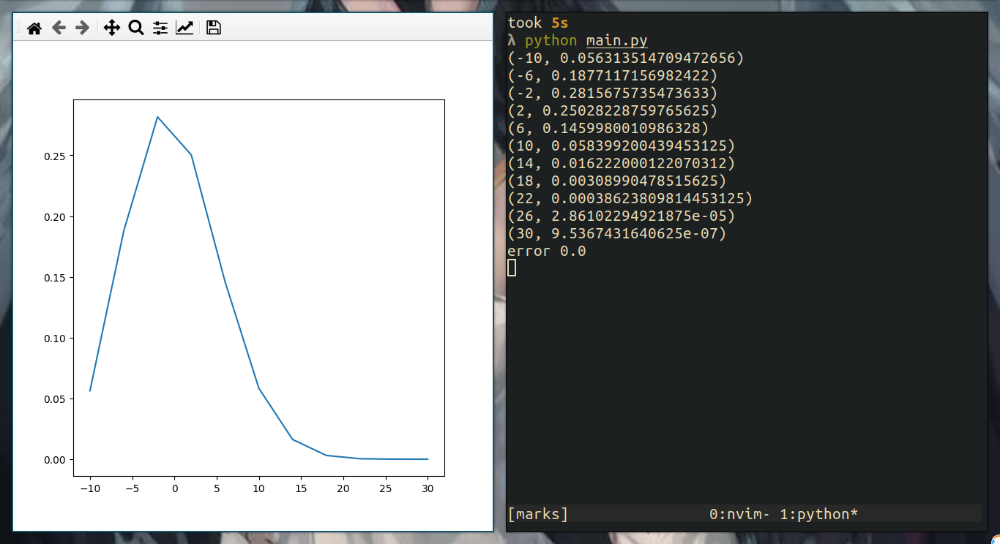

# How likely are your marks

it uses binomial distribution to display what are likely outcomes of test
if you don't know anything

the values are hard coded so change them according to your hearts content

an image showing marks distribution with 3 points of correct and -1 for incorrect
with a total of 10 question, each question has 4 options

